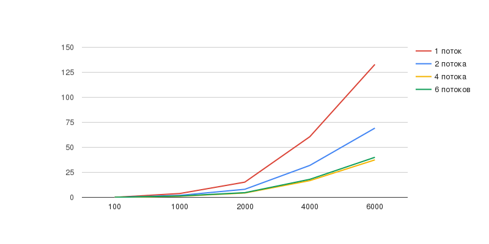
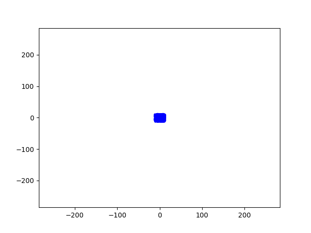

# Solution differential equations

## Build & run

```ps
gcc main.c -o main -lm 
```

```ps
./main ./input.txt
```

## Visualize

```ps
[Google Colab](https://colab.research.google.com/drive/1rI4FxGoDJ9k33Rmlw1l-vG-S-okDQCmd#scrollTo=QcIsRvZtHcWp)
```

## Test

### Specs

- AMD Ryzen™ 7 7800X3D CPU @ 4.2GHz - 5.6 GHz (12 cores, 24 threads) only 4 cores used
- gcc compiler 13.2.0

### Comparison chart



### Visualization


